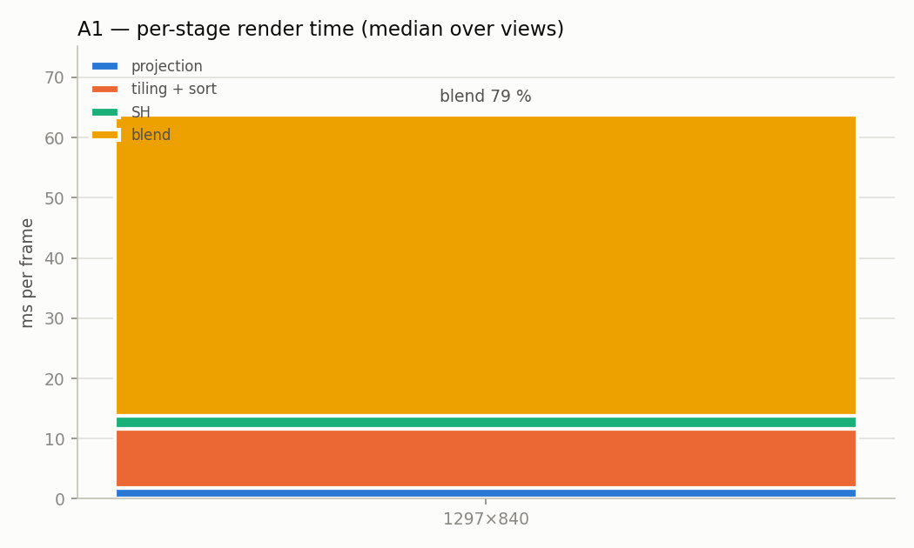
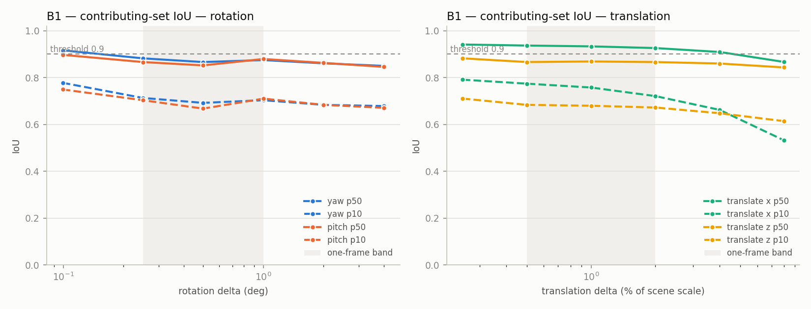
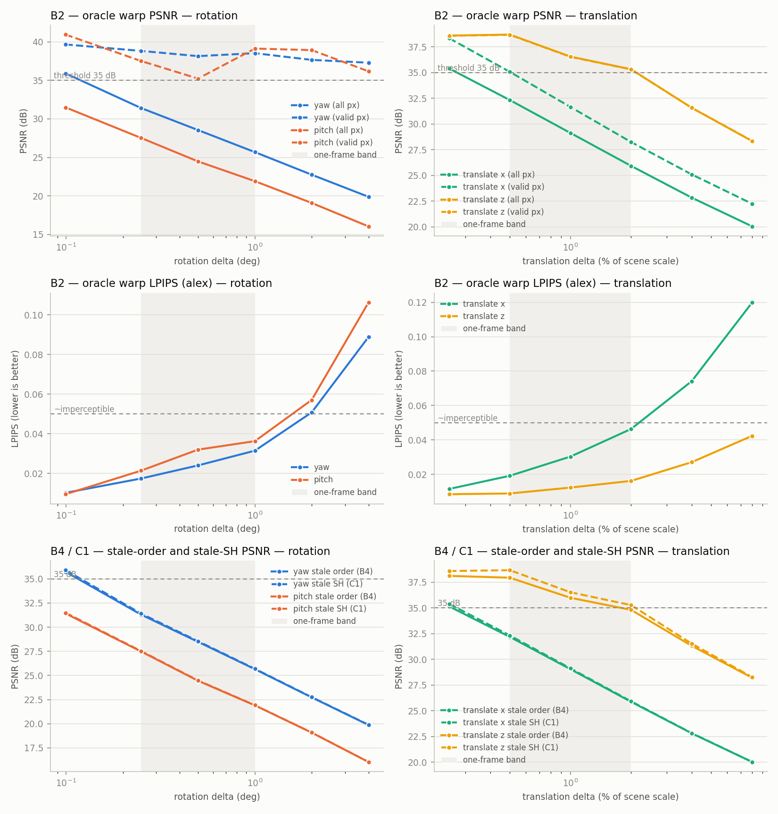
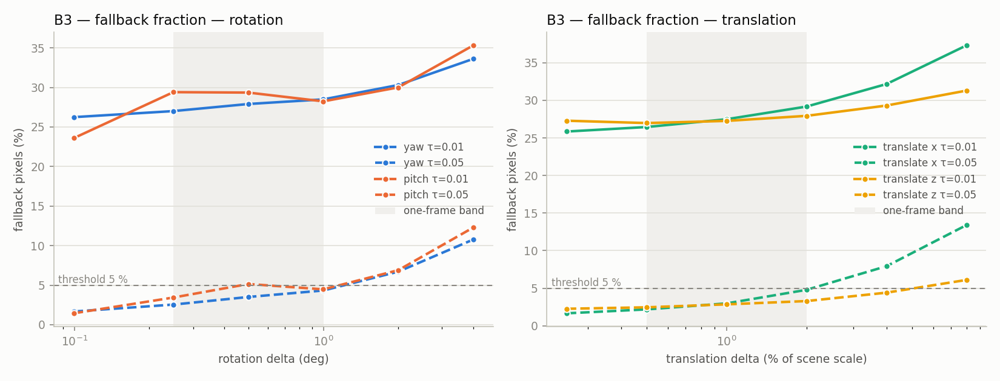

# Phase 0 — 2DGS visibility-caching feasibility report

Source directory: `C:\Users\admin\Desktop\gsplat\examples\instrumentation\out`

Inputs: `premise_timing.csv` (found, 2 rows), `premise_pixels.csv` (found, 8 rows), `temporal_pairs.csv` (found, 53 rows)

## Go / no-go

Temporal criteria use the **smallest** rotation and translation deltas in the sweep (median over kinds and views); the timing criterion uses the **largest** resolution; A2 uses the largest resolution and smallest ε.

| ID | criterion | evidence | verdict |
|---|---|---|---|
| A1 | blend ≥ 50 % of frame time at the largest resolution | 1297×840: blend = 79.1 % | PASS |
| A2 | median evaluated / contributing ≥ 5× | 1297×840, ε=0.001: ratio p50 = 96.03 | PASS |
| B1 | median IoU > 0.9 at the smallest deltas | rot 0.1°: IoU p50 = 0.906; trans 0.25 %: IoU p50 = 0.911 | PASS |
| B2 | oracle PSNR ≥ 35 dB at the smallest deltas (LPIPS reported, not gated) | rot 0.1°: PSNR = 33.70 dB; trans 0.25 %: PSNR = 37.00 dB | rot 0.1°: LPIPS = 0.0098; trans 0.25 %: LPIPS = 0.0099 | FAIL |
| B3 | fallback fraction < 5 % at the smallest deltas (τ=0.01) | rot 0.1°: fallback = 24.91 %; trans 0.25 %: fallback = 26.57 % | FAIL |
| B4 | order inversions / stale-order error (report only) | rot 0.1°: inversion frac = 0.05 %; trans 0.25 %: inversion frac = 0.00 % | rot 0.1°: PSNR stale order = 33.58 dB; trans 0.25 %: PSNR stale order = 36.64 dB | INFO |
| B5 | candidate union / quad sharing (report only) | rot 0.1°: union = 21.03 % of N; trans 0.25 %: union = 21.02 % of N | rot 0.1°: quad share = 0.335; trans 0.25 %: quad share = 0.335 | INFO |
| C1 | stale-SH oracle quality (report only) | rot 0.1°: PSNR stale SH = 33.70 dB; trans 0.25 %: PSNR stale SH = 36.99 dB | INFO |

**Overall: NO-GO** (3/5 gated criteria pass; 0 N/A).

## A1 — Per-stage timing

Rows: 2 (views × resolutions). Values are medians over views at each resolution.

| resolution | views | N | isects | projection | tiling + sort | SH | blend | total ms | blend frac |
|---|---|---|---|---|---|---|---|---|---|
| 1297×840 | 2 | 2,627,583 | 12,625,981 | 1.74 | 9.90 | 2.15 | 49.93 | 68.37 | 79.1 % |

## A2 — Evaluated vs contributing surfels per pixel

Rows: 8 (views × resolutions × ε). Values are medians over views. `n_contrib` = raw kernel contributor count (α ≥ 1/255), `n_contrib_ε` = contributors with weight > ε, `n_eval` = surfels evaluated by the rasterizer for that pixel, `ratio` = n_eval / max(n_contrib_ε, 1). `psnr_trunc` = PSNR of the ε-truncated recomposite vs the full render.

| resolution | ε | views | contrib p50 | contrib p90 | contrib_ε p50 | contrib_ε p90 | eval p50 | eval p90 | tile_len p50 | acc_α p50 | ratio mean | ratio p50 | ratio p90 | ratio p99 | psnr_trunc |
|---|---|---|---|---|---|---|---|---|---|---|---|---|---|---|---|
| 1297×840 | 0.001 | 2 | 45.0 | 61.0 | 28.0 | 38.0 | 2,644 | 2,986 | 2,705 | 1.000 | 107.25 | 96.03 | 147.61 | 260.82 | 55.17 |
| 1297×840 | 0.005 | 2 | 45.0 | 61.0 | 19.0 | 26.0 | 2,644 | 2,986 | 2,705 | 1.000 | 154.47 | 139.91 | 212.32 | 371.36 | 37.91 |
| 1297×840 | 0.01 | 2 | 45.0 | 61.0 | 14.5 | 19.5 | 2,644 | 2,986 | 2,705 | 1.000 | 205.43 | 186.48 | 283.04 | 501.27 | 30.81 |
| 1297×840 | 0.05 | 2 | 45.0 | 61.0 | 5.0 | 7.0 | 2,644 | 2,986 | 2,705 | 1.000 | 550.34 | 502.65 | 776.46 | 1,416 | 17.72 |

### A2 — full percentiles at native resolution (1297×840)

| ε | metric | mean | p50 | p90 | p99 | max |
|---|---|---|---|---|---|---|
| 0.001 | acc_alpha | 0.99 | 1.00 | 1.00 | 1.00 | 1.00 |
| 0.001 | n_contrib | 45.08 | 45.00 | 61.00 | 88.00 | 179.50 |
| 0.001 | n_contrib_eps | 28.17 | 28.00 | 38.00 | 52.00 | 104.50 |
| 0.001 | n_eval | 2,713 | 2,644 | 2,986 | 3,809 | 18,578 |
| 0.001 | ratio | 107.25 | 96.03 | 147.61 | 260.82 | 2,560 |
| 0.001 | tile_len | 2,914 | 2,705 | 3,474 | 4,924 | 20,342 |
| 0.005 | acc_alpha | 0.99 | 1.00 | 1.00 | 1.00 | 1.00 |
| 0.005 | n_contrib | 45.08 | 45.00 | 61.00 | 88.00 | 179.50 |
| 0.005 | n_contrib_eps | 19.34 | 19.00 | 26.00 | 34.00 | 59.00 |
| 0.005 | n_eval | 2,713 | 2,644 | 2,986 | 3,809 | 18,578 |
| 0.005 | ratio | 154.47 | 139.91 | 212.32 | 371.36 | 2,981 |
| 0.005 | tile_len | 2,914 | 2,705 | 3,474 | 4,924 | 20,342 |
| 0.01 | acc_alpha | 0.99 | 1.00 | 1.00 | 1.00 | 1.00 |
| 0.01 | n_contrib | 45.08 | 45.00 | 61.00 | 88.00 | 179.50 |
| 0.01 | n_contrib_eps | 14.48 | 14.50 | 19.50 | 24.00 | 40.00 |
| 0.01 | n_eval | 2,713 | 2,644 | 2,986 | 3,809 | 18,578 |
| 0.01 | ratio | 205.43 | 186.48 | 283.04 | 501.27 | 3,792 |
| 0.01 | tile_len | 2,914 | 2,705 | 3,474 | 4,924 | 20,342 |
| 0.05 | acc_alpha | 0.99 | 1.00 | 1.00 | 1.00 | 1.00 |
| 0.05 | n_contrib | 45.08 | 45.00 | 61.00 | 88.00 | 179.50 |
| 0.05 | n_contrib_eps | 5.43 | 5.00 | 7.00 | 9.00 | 12.50 |
| 0.05 | n_eval | 2,713 | 2,644 | 2,986 | 3,809 | 18,578 |
| 0.05 | ratio | 550.34 | 502.65 | 776.46 | 1,416 | 14,002 |
| 0.05 | tile_len | 2,914 | 2,705 | 3,474 | 4,924 | 20,342 |

## Temporal measurements (B1–B5, C1)

Rows: 53 pose pairs; N = 2,627,583; ε = 0.005; K = 32; radius = 1. Values are medians over base views at each (kind, delta). The grey band on the plots marks the one-frame regime from PLAN.md (0.25–1.0°, 0.5–2.0 % of scene scale).

### B1 — Contributing-set IoU vs delta

| kind | delta | views | valid frac | IoU mean | IoU p10 | IoU p50 |
|---|---|---|---|---|---|---|
| rot_yaw | 0.1° (meas. 0.10°) | 2 | 99.3 % | 0.900 | 0.777 | 0.916 |
| rot_yaw | 0.25° (meas. 0.25°) | 2 | 98.9 % | 0.863 | 0.713 | 0.882 |
| rot_yaw | 0.5° (meas. 0.50°) | 2 | 98.4 % | 0.849 | 0.692 | 0.866 |
| rot_yaw | 1° (meas. 1.00°) | 2 | 97.4 % | 0.857 | 0.703 | 0.875 |
| rot_yaw | 2° (meas. 2.00°) | 2 | 95.3 % | 0.843 | 0.683 | 0.861 |
| rot_yaw | 4° (meas. 4.00°) | 2 | 91.5 % | 0.833 | 0.678 | 0.850 |
| rot_pitch | 0.1° (meas. 0.10°) | 2 | 99.2 % | 0.880 | 0.749 | 0.897 |
| rot_pitch | 0.25° (meas. 0.25°) | 2 | 98.8 % | 0.852 | 0.703 | 0.866 |
| rot_pitch | 0.5° (meas. 0.50°) | 2 | 98.2 % | 0.834 | 0.667 | 0.852 |
| rot_pitch | 1° (meas. 1.00°) | 2 | 96.9 % | 0.860 | 0.710 | 0.879 |
| rot_pitch | 2° (meas. 2.00°) | 2 | 94.5 % | 0.844 | 0.683 | 0.863 |
| rot_pitch | 4° (meas. 4.00°) | 2 | 89.6 % | 0.831 | 0.671 | 0.845 |
| trans_x | 0.25 % (meas. 0.25 %) | 2 | 99.3 % | 0.915 | 0.791 | 0.941 |
| trans_x | 0.5 % (meas. 0.50 %) | 2 | 99.2 % | 0.908 | 0.774 | 0.937 |
| trans_x | 1 % (meas. 1.00 %) | 2 | 98.9 % | 0.899 | 0.757 | 0.933 |
| trans_x | 2 % (meas. 2.00 %) | 2 | 98.4 % | 0.882 | 0.721 | 0.926 |
| trans_x | 4 % (meas. 4.00 %) | 2 | 97.4 % | 0.854 | 0.662 | 0.909 |
| trans_x | 8 % (meas. 8.00 %) | 2 | 95.4 % | 0.800 | 0.532 | 0.867 |
| trans_z | 0.25 % (meas. 0.25 %) | 2 | 99.4 % | 0.862 | 0.710 | 0.882 |
| trans_z | 0.5 % (meas. 0.50 %) | 2 | 99.4 % | 0.848 | 0.683 | 0.866 |
| trans_z | 1 % (meas. 1.00 %) | 2 | 99.5 % | 0.846 | 0.679 | 0.869 |
| trans_z | 2 % (meas. 2.00 %) | 2 | 99.5 % | 0.843 | 0.672 | 0.866 |
| trans_z | 4 % (meas. 4.00 %) | 2 | 99.5 % | 0.830 | 0.648 | 0.860 |
| trans_z | 8 % (meas. 8.00 %) | 2 | 99.6 % | 0.811 | 0.614 | 0.843 |

### B2 — Oracle warp quality vs delta

| kind | delta | PSNR oracle | PSNR oracle (valid px) | LPIPS oracle | cap-bind frac | mean candidates/px |
|---|---|---|---|---|---|---|
| rot_yaw | 0.1° (meas. 0.10°) | 35.90 | 39.66 | 0.0102 | 60.2 % | 29.5 |
| rot_yaw | 0.25° (meas. 0.25°) | 31.41 | 38.82 | 0.0174 | 60.2 % | 29.5 |
| rot_yaw | 0.5° (meas. 0.50°) | 28.55 | 38.14 | 0.0240 | 60.3 % | 29.5 |
| rot_yaw | 1° (meas. 1.00°) | 25.69 | 38.53 | 0.0315 | 60.3 % | 29.5 |
| rot_yaw | 2° (meas. 2.00°) | 22.76 | 37.66 | 0.0508 | 60.5 % | 29.5 |
| rot_yaw | 4° (meas. 4.00°) | 19.89 | 37.29 | 0.0889 | 60.7 % | 29.6 |
| rot_pitch | 0.1° (meas. 0.10°) | 31.49 | 40.94 | 0.0095 | 60.3 % | 29.5 |
| rot_pitch | 0.25° (meas. 0.25°) | 27.53 | 37.51 | 0.0214 | 60.3 % | 29.5 |
| rot_pitch | 0.5° (meas. 0.50°) | 24.48 | 35.23 | 0.0320 | 60.5 % | 29.5 |
| rot_pitch | 1° (meas. 1.00°) | 21.92 | 39.12 | 0.0363 | 60.7 % | 29.5 |
| rot_pitch | 2° (meas. 2.00°) | 19.09 | 38.93 | 0.0571 | 61.1 % | 29.5 |
| rot_pitch | 4° (meas. 4.00°) | 16.05 | 36.17 | 0.1063 | 62.1 % | 29.5 |
| trans_x | 0.25 % (meas. 0.25 %) | 35.40 | 38.34 | 0.0115 | 60.2 % | 29.5 |
| trans_x | 0.5 % (meas. 0.50 %) | 32.33 | 35.07 | 0.0191 | 60.2 % | 29.5 |
| trans_x | 1 % (meas. 1.00 %) | 29.13 | 31.66 | 0.0303 | 60.2 % | 29.5 |
| trans_x | 2 % (meas. 2.00 %) | 25.93 | 28.25 | 0.0464 | 60.2 % | 29.5 |
| trans_x | 4 % (meas. 4.00 %) | 22.84 | 25.10 | 0.0741 | 60.0 % | 29.5 |
| trans_x | 8 % (meas. 8.00 %) | 20.04 | 22.24 | 0.1200 | 59.8 % | 29.5 |
| trans_z | 0.25 % (meas. 0.25 %) | 38.60 | 38.58 | 0.0084 | 60.3 % | 29.5 |
| trans_z | 0.5 % (meas. 0.50 %) | 38.70 | 38.68 | 0.0089 | 60.3 % | 29.5 |
| trans_z | 1 % (meas. 1.00 %) | 36.56 | 36.54 | 0.0123 | 60.3 % | 29.5 |
| trans_z | 2 % (meas. 2.00 %) | 35.33 | 35.31 | 0.0162 | 60.4 % | 29.5 |
| trans_z | 4 % (meas. 4.00 %) | 31.58 | 31.58 | 0.0270 | 60.7 % | 29.5 |
| trans_z | 8 % (meas. 8.00 %) | 28.33 | 28.36 | 0.0424 | 61.2 % | 29.5 |

### B3 — Fallback fraction vs delta

| kind | delta | fallback τ=0.01 | fallback τ=0.05 |
|---|---|---|---|
| rot_yaw | 0.1° (meas. 0.10°) | 26.24 % | 1.67 % |
| rot_yaw | 0.25° (meas. 0.25°) | 27.01 % | 2.55 % |
| rot_yaw | 0.5° (meas. 0.50°) | 27.90 % | 3.51 % |
| rot_yaw | 1° (meas. 1.00°) | 28.49 % | 4.33 % |
| rot_yaw | 2° (meas. 2.00°) | 30.30 % | 6.71 % |
| rot_yaw | 4° (meas. 4.00°) | 33.61 % | 10.77 % |
| rot_pitch | 0.1° (meas. 0.10°) | 23.59 % | 1.44 % |
| rot_pitch | 0.25° (meas. 0.25°) | 29.40 % | 3.44 % |
| rot_pitch | 0.5° (meas. 0.50°) | 29.35 % | 5.15 % |
| rot_pitch | 1° (meas. 1.00°) | 28.24 % | 4.47 % |
| rot_pitch | 2° (meas. 2.00°) | 30.00 % | 6.90 % |
| rot_pitch | 4° (meas. 4.00°) | 35.31 % | 12.28 % |
| trans_x | 0.25 % (meas. 0.25 %) | 25.85 % | 1.66 % |
| trans_x | 0.5 % (meas. 0.50 %) | 26.45 % | 2.18 % |
| trans_x | 1 % (meas. 1.00 %) | 27.49 % | 2.98 % |
| trans_x | 2 % (meas. 2.00 %) | 29.17 % | 4.79 % |
| trans_x | 4 % (meas. 4.00 %) | 32.17 % | 7.93 % |
| trans_x | 8 % (meas. 8.00 %) | 37.31 % | 13.39 % |
| trans_z | 0.25 % (meas. 0.25 %) | 27.29 % | 2.26 % |
| trans_z | 0.5 % (meas. 0.50 %) | 26.98 % | 2.46 % |
| trans_z | 1 % (meas. 1.00 %) | 27.27 % | 2.85 % |
| trans_z | 2 % (meas. 2.00 %) | 27.94 % | 3.29 % |
| trans_z | 4 % (meas. 4.00 %) | 29.31 % | 4.41 % |
| trans_z | 8 % (meas. 8.00 %) | 31.29 % | 6.10 % |

### B4 — Order stability (shared candidates, A's order vs B's order)

| kind | delta | inversion frac | inverted-pair A-depth gap p50 | PSNR stale order | PSNR fresh order (oracle) |
|---|---|---|---|---|---|
| rot_yaw | 0.1° (meas. 0.10°) | 0.05 % | 0.0000 | 35.73 | 35.90 |
| rot_yaw | 0.25° (meas. 0.25°) | 0.14 % | 0.0000 | 31.30 | 31.41 |
| rot_yaw | 0.5° (meas. 0.50°) | 0.27 % | 0.0001 | 28.48 | 28.55 |
| rot_yaw | 1° (meas. 1.00°) | 0.53 % | 0.0002 | 25.65 | 25.69 |
| rot_yaw | 2° (meas. 2.00°) | 1.04 % | 0.0004 | 22.73 | 22.76 |
| rot_yaw | 4° (meas. 4.00°) | 1.99 % | 0.0007 | 19.87 | 19.89 |
| rot_pitch | 0.1° (meas. 0.10°) | 0.04 % | 0.0000 | 31.42 | 31.49 |
| rot_pitch | 0.25° (meas. 0.25°) | 0.09 % | 0.0000 | 27.48 | 27.53 |
| rot_pitch | 0.5° (meas. 0.50°) | 0.19 % | 0.0001 | 24.45 | 24.48 |
| rot_pitch | 1° (meas. 1.00°) | 0.35 % | 0.0001 | 21.91 | 21.92 |
| rot_pitch | 2° (meas. 2.00°) | 0.72 % | 0.0003 | 19.08 | 19.09 |
| rot_pitch | 4° (meas. 4.00°) | 1.41 % | 0.0005 | 16.04 | 16.05 |
| trans_x | 0.25 % (meas. 0.25 %) | 0.00 % | – | 35.15 | 35.40 |
| trans_x | 0.5 % (meas. 0.50 %) | 0.00 % | – | 32.18 | 32.33 |
| trans_x | 1 % (meas. 1.00 %) | 0.00 % | – | 29.05 | 29.13 |
| trans_x | 2 % (meas. 2.00 %) | 0.00 % | – | 25.88 | 25.93 |
| trans_x | 4 % (meas. 4.00 %) | 0.00 % | – | 22.82 | 22.84 |
| trans_x | 8 % (meas. 8.00 %) | 0.00 % | – | 20.02 | 20.04 |
| trans_z | 0.25 % (meas. 0.25 %) | 0.00 % | 0.0000 | 38.12 | 38.60 |
| trans_z | 0.5 % (meas. 0.50 %) | 0.00 % | 0.0000 | 37.95 | 38.70 |
| trans_z | 1 % (meas. 1.00 %) | 0.00 % | 0.0000 | 35.99 | 36.56 |
| trans_z | 2 % (meas. 2.00 %) | 0.00 % | 0.0000 | 34.82 | 35.33 |
| trans_z | 4 % (meas. 4.00 %) | 0.00 % | 0.0000 | 31.33 | 31.58 |
| trans_z | 8 % (meas. 8.00 %) | 0.00 % | 0.0000 | 28.21 | 28.33 |

### B5 — Candidate union size and 2×2-quad sharing

| kind | delta | union |∪C(p)| / N | quad share | mean candidates/px |
|---|---|---|---|---|
| rot_yaw | 0.1° (meas. 0.10°) | 21.03 % | 0.336 | 29.5 |
| rot_yaw | 0.25° (meas. 0.25°) | 20.98 % | 0.336 | 29.5 |
| rot_yaw | 0.5° (meas. 0.50°) | 20.90 % | 0.336 | 29.5 |
| rot_yaw | 1° (meas. 1.00°) | 20.74 % | 0.336 | 29.5 |
| rot_yaw | 2° (meas. 2.00°) | 20.41 % | 0.336 | 29.5 |
| rot_yaw | 4° (meas. 4.00°) | 19.76 % | 0.337 | 29.6 |
| rot_pitch | 0.1° (meas. 0.10°) | 21.03 % | 0.335 | 29.5 |
| rot_pitch | 0.25° (meas. 0.25°) | 21.00 % | 0.336 | 29.5 |
| rot_pitch | 0.5° (meas. 0.50°) | 20.94 % | 0.336 | 29.5 |
| rot_pitch | 1° (meas. 1.00°) | 20.84 % | 0.336 | 29.5 |
| rot_pitch | 2° (meas. 2.00°) | 20.61 % | 0.337 | 29.5 |
| rot_pitch | 4° (meas. 4.00°) | 20.12 % | 0.338 | 29.5 |
| trans_x | 0.25 % (meas. 0.25 %) | 21.02 % | 0.336 | 29.5 |
| trans_x | 0.5 % (meas. 0.50 %) | 20.98 % | 0.336 | 29.5 |
| trans_x | 1 % (meas. 1.00 %) | 20.91 % | 0.337 | 29.5 |
| trans_x | 2 % (meas. 2.00 %) | 20.76 % | 0.338 | 29.5 |
| trans_x | 4 % (meas. 4.00 %) | 20.43 % | 0.340 | 29.5 |
| trans_x | 8 % (meas. 8.00 %) | 19.78 % | 0.343 | 29.5 |
| trans_z | 0.25 % (meas. 0.25 %) | 21.02 % | 0.335 | 29.5 |
| trans_z | 0.5 % (meas. 0.50 %) | 20.97 % | 0.335 | 29.5 |
| trans_z | 1 % (meas. 1.00 %) | 20.84 % | 0.335 | 29.5 |
| trans_z | 2 % (meas. 2.00 %) | 20.66 % | 0.335 | 29.5 |
| trans_z | 4 % (meas. 4.00 %) | 20.21 % | 0.336 | 29.5 |
| trans_z | 8 % (meas. 8.00 %) | 19.31 % | 0.335 | 29.5 |

### C1 — Oracle warp with stale per-surfel RGB (no SH re-eval)

| kind | delta | PSNR stale SH | PSNR fresh SH (oracle) | Δ dB |
|---|---|---|---|---|
| rot_yaw | 0.1° (meas. 0.10°) | 35.90 | 35.90 | 0.00 |
| rot_yaw | 0.25° (meas. 0.25°) | 31.41 | 31.41 | 0.00 |
| rot_yaw | 0.5° (meas. 0.50°) | 28.55 | 28.55 | 0.00 |
| rot_yaw | 1° (meas. 1.00°) | 25.69 | 25.69 | 0.00 |
| rot_yaw | 2° (meas. 2.00°) | 22.76 | 22.76 | 0.00 |
| rot_yaw | 4° (meas. 4.00°) | 19.89 | 19.89 | 0.00 |
| rot_pitch | 0.1° (meas. 0.10°) | 31.49 | 31.49 | 0.00 |
| rot_pitch | 0.25° (meas. 0.25°) | 27.53 | 27.53 | 0.00 |
| rot_pitch | 0.5° (meas. 0.50°) | 24.48 | 24.48 | 0.00 |
| rot_pitch | 1° (meas. 1.00°) | 21.92 | 21.92 | 0.00 |
| rot_pitch | 2° (meas. 2.00°) | 19.09 | 19.09 | 0.00 |
| rot_pitch | 4° (meas. 4.00°) | 16.05 | 16.05 | 0.00 |
| trans_x | 0.25 % (meas. 0.25 %) | 35.39 | 35.40 | -0.00 |
| trans_x | 0.5 % (meas. 0.50 %) | 32.33 | 32.33 | -0.00 |
| trans_x | 1 % (meas. 1.00 %) | 29.13 | 29.13 | -0.00 |
| trans_x | 2 % (meas. 2.00 %) | 25.92 | 25.93 | -0.00 |
| trans_x | 4 % (meas. 4.00 %) | 22.84 | 22.84 | -0.01 |
| trans_x | 8 % (meas. 8.00 %) | 20.03 | 20.04 | -0.01 |
| trans_z | 0.25 % (meas. 0.25 %) | 38.59 | 38.60 | -0.01 |
| trans_z | 0.5 % (meas. 0.50 %) | 38.68 | 38.70 | -0.02 |
| trans_z | 1 % (meas. 1.00 %) | 36.53 | 36.56 | -0.03 |
| trans_z | 2 % (meas. 2.00 %) | 35.28 | 35.33 | -0.04 |
| trans_z | 4 % (meas. 4.00 %) | 31.54 | 31.58 | -0.04 |
| trans_z | 8 % (meas. 8.00 %) | 28.28 | 28.33 | -0.06 |

### Trajectory pairs (interpolated path, consecutive frames)

| step | rot (°) | trans (%) | IoU p50 | PSNR oracle | LPIPS oracle | fallback τ=0.01 | fallback τ=0.05 | inversion frac | PSNR stale order | PSNR stale SH |
|---|---|---|---|---|---|---|---|---|---|---|
| 1 | 0.864 | 1.651 | 0.850 | 27.99 | 0.0339 | 31.22 % | 4.62 % | 0.44 % | 27.89 | 28.00 |
| 2 | 0.881 | 1.651 | 0.852 | 27.89 | 0.0344 | 30.98 % | 4.58 % | 0.44 % | 27.79 | 27.90 |
| 3 | 0.897 | 1.651 | 0.852 | 28.07 | 0.0351 | 30.82 % | 4.51 % | 0.45 % | 27.96 | 28.07 |
| 4 | 0.914 | 1.651 | 0.857 | 28.00 | 0.0364 | 30.66 % | 4.46 % | 0.45 % | 27.90 | 28.00 |
| 5 | 0.930 | 1.651 | 0.857 | 27.78 | 0.0358 | 30.60 % | 4.48 % | 0.45 % | 27.68 | 27.78 |

